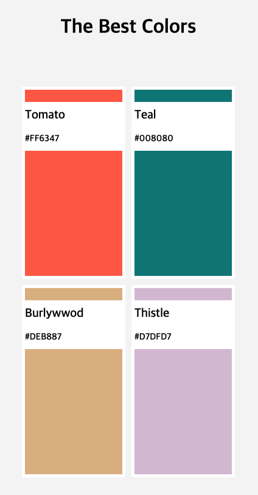
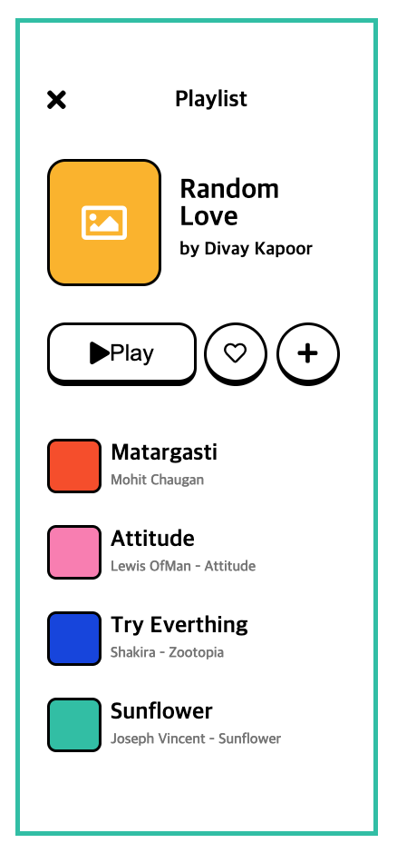

# nomard-html-css

| assignment 4 | assignment 6 | assignment 7 | assignment 8
| :-- | :-- | :-- | :-- 
|  |  |  | 

## assignment 9

## assignment 10

## assignment 11

## assignment 12

[source link][https://github.com/wjy5446/kokoa-clone]
[page link][https://wjy5446.github.io/kokoa-clone/]

